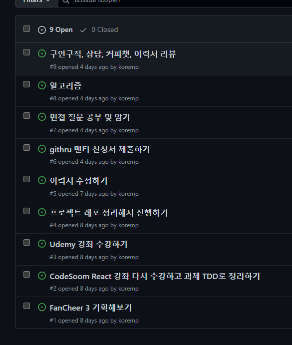

# 2022년 5월 회고

나중에 이 회고와 TIL을 블로그 커스터마이징해서 마이그레이션 해야할테지만... 일단 레포지토리에 작성한다.

## 작년 7월 ~ 9월

나는 작년 7월에 퇴사를 한 뒤, 지금까지 직장을 구하지 못하고 있다.
작년 7월부터 9월까지 300개 정도 지원하고, 회고를 한 번 썼다.
<https://velog.io/@koremp/jr-fe-interview-failure-rewind>

## 작년 10월 ~ 12월

그런데 10월부터 정신적으로 부담감과 불안감이 너무 커져서 12월까지 휴식기간을 가졌다.

## 올해 1월 ~ 2월

그리고 2022년, 1월에 프로그래밍 재활의 일환으로 <htps://github.com/koremp/fancheer-ts-2>를 작업했다.
Next.js, React.js를 이용해서 만들었는데, 사용성을 염두해놓고 만든 것도 아니고, 사용자를 예상하고 만든 것도 아닌 프로젝트여서 좋은 포트폴리오용 프로젝트가 되지는 않았다.

## 올해 3월 이후

어쨌든 재활용 사이드 프로젝트도 해보고, 몇 개의 회사에 지원해봤는데, 결과가 다 좋지 않았다.
그리고 정신적으로 힘든 일들도 몇가지 생겨서, 온전히 집중하지 못했다.

### 2022 프론트엔드 로드맵

그러던 와중에 조은님의 2022 프론트엔드 로드맵 미디엄 글을 보고 따라해보는 기간을 가졌다. <https://github.com/koremp/fe-roadmap-study> 해당 공부를 하며 작성한 레포
물론 JavaScript 기초나 HTML, CSS, Next.js 기초 도큐먼트를 보면서 배우는 것들이 많았다.
2주간의 스프린트를 통해 매일 일정한 시간의 공부를 했고, 그것이 주는 안정감도 있었다.
하지만 나는 프론트엔드 인턴 경력도 있고 이것보다 좀 더 빠르게 성취를 하고 회사에 어필이 될만한 무언가를 할 수 있을것이라고 생각했다.

### 개인 프로젝트와 면접 공부하기

그래서 다른 개발자분에게 조언을 구했고, 그 결과로 로드맵의 내용을 공부하는 것 보다 개인 프로젝트를 하기로 했다.
그리고 가장 중요하게도, 내가 `프론트엔드 면접 질문` 리스트들의 내용에 대해 공부하는 것에 대한 답을 주셨다.
회사가 가장 적은 코스트로 지원자를 검증할 수 있는 방법이 그 공통된 면접 질문을 하는 것이었고, 수능같은 것이라고 생각하라고 하셨다.

### 그런데(1) - TDD 재학습, 기획하기

그런데 프로젝트를 하려고 하니까, 내가 React.js를 처음 배웠던 방법은 TDD를 통해서 배웠다는 것을 깨달았다.
그리고 난 TDD 기술을 다 까먹었기 때문에 다시 TDD를 공부하기 위해서 당시 수강했던 강좌와 과제를 해결하고 있었다.
또한 개인 프로젝트를 어떠한 계획이나 기획을 세워서 진행하지 않았기 때문에, 어떻게 프로젝트를 진행하는지에 대해서도 제작년에 수강했던 코드숨의 멘토분들이 가르쳐주셨다.

### 그런데(2) - 혼자서는 힘들어요

근데 프론트엔드 로드맵을 공부할 때와 다르게, 이번에 내가 가는 과정들은 어떠한 커리큘럼이 있던 것도 아니었다.
그리고 내가 온전히 집중해서 강좌를 듣고, 과제를 해결하고, 프로젝트를 진행할 수 없었다.
집중하지 못하고, 동기부여가 계속 끊기고, 스터디카페를 가지 못하고, 악순환이 반복되었다.
해야 할 일들을 정리했지만, 우선순위가 정리가 안되어서, 부담감을 많이 느끼고 결국 일에 손을 전혀 못대게 된 것이다.
정신적으로도, 성취감이 없기 때문에 지속적으로 성장하기 힘들었다.

### 그런데(3) - 너무 할 게 많아요

이것은 <https://github.com/koremp/koremp/issues> 내 깃헙 프로필 레포지토리의 issue로 정리한 TodoList이다.
나한테는 할 것들이 너무 많아보였다. 구매한 Udemy 강좌도 너무 많고, 프로젝트 아이디어도 너무 많았고, 할 일이 너무 많았다.
물론 난 할 시간이 넘쳐나는 백수였지만... 
나에겐 그것을 할 동기가 많이 부여되지 않는 경우 집중이 되지 않고 억지로 하지도 못하는 성격의 인간이여서, 할 수 없었다.
또 너무 부담감도 너무 컸고, 진행상황 등이 가시화가 되지 않으니까 성취감도 없어서 이렇게 하는 것은 아니라고 생각했다.

## 그래서(1) - 빠른 취업

일단 나 혼자서 무언가를 하는 것은 힘들다고 생각했다.
우선 지금 취준기간이 너무 길어졌다.
그리고 내 스스로 본가에 있으면서 스트레스를 받는 상황이 수차례 있었기 때문에, 독립을 빨리 해야한다고 느꼈다.
나 혼자서 프로젝트를 진행하면서 사이드 프로젝트를 완성하여 면접관들의 이목을 끌 수 있다면 좋겠고 최선이겠지만, 내가 그렇게 진행할 자신이 없었다.

## 그래서(2) - 이력서 다시 쓰기

이력서를 다시 쓰고, 주변 개발자분들에게 검토를 받자고 생각했다.
내가 2016년에 소프트웨어 마이스터 고등학교를 입학했고, 아직까지 경력은 1년이 되지 않는다.
하지만 그 6년이 넘는 기간동안 많은 이 업계에 대해 많은 뉴스/블로그 글 등을 읽어왔다.
그리고 이력서 작성 관련 문서도 정말 많이 봤으니까, 내 이력서와 자기소개서 등 내 장점을 최대화시킬 수 있는, 그런 이력서를 만들어야겠다고 결론을 내렸다.

### 다시 작성할 이력서 중 부각할 나의 장점

나의 경우 소프트웨어 관련 특성화고를 졸업했고, 산업기능요원 보충역(4급)으로 근무가 가능하다는 특징이 있다.
프로그래밍을 거의 포기했었지만, 파이콘 2019 한국 커뮤니티 자원봉사를 하며 많은 인사이트들을 얻었다는 것.
결국 프론트엔드 인턴으로 일해본 경험도 있고, 흔한 면접 질문에서 회의감을 느껴 이런 반년이 넘는 시간을 고민하며 그 이유를 찾았다는 것.
인턴 기간 회사에 기술적으로 많은 제안을 했고, 회사 문화에도 인턴이지만 여러 제안들을 한 것 등 인턴기간 내에서 했던 행동들이 어필할 수 있는 것들이 많다.
이 외에도 회사에 어필할 수 있는 장점들이 많다고 생각했고, 기존의 이력서는 이 장점을 온전히 담지 못했다고 생각했다.
그래서 나에게 맞는 이력서를 작성해야겠다고 생각했다.

### 이력서 리뷰

그리고 페이스북 외에 트위터/링크드인 등 많은 개발자분들께 도움을 요청할 수 있을 것이라고 생각했다.
그래서 그런 점에서는 마냥 힘들진 않겠다고 느껴졌고, 더 짧은 텀의 행동과 피드백을 얻을 수 있으리라 생각했다.

다만 나의 경우 너무 많은 정보를 얻게 될 경우엔 스스로 결정하는 것이 힘들었던 경험이 있기 때문에, 이력서 리뷰의 경우 1분 혹은 2분의 개발자분께 부탁드릴 생각이다.

## 이력서 제출

취준기간동안 많은 조언을 주신 다른 개발자분께서, `가고싶은 회사 리스트를 만들고, 상대적으로 낮은 회사부터 5개씩 배치를 하여 진행하는 것`을 추천해주셨다.
그래서 그렇게 할 생각!이다.

## 총평

올해 1월부터 5월까지 참 많은 일이 있었는데, 백수여서 시간이 정말 빨리간 것 같기도 하다.
혼자서 고민하는 경우가 많고, 그것에 대해 스스로 내린 결론이 결과적으로 좋지 않은 것이 많았다.
그래서 앞으로는 하루 이상 오래 고민하지 말고 커뮤니티에 질문을 구체화해서 조언을 구해보자는 결심을 했다.

트위터에 있는 개발자분들과 교류하는 것이 참 어려운데, 트위터라는 앱의 특징이 그런 것 같다.
건전하게 이용할 수 있었으면 좋겠다.

빨리 취업해서 독립하고... 서울 갔으면 좋겠다...
인턴기간동안 독립해서 높아진 기준에 갑자기 본가로 돌아와서 예상치 못하게 1년 가까이 살고 있으니까 부정적인 영향을 많이 받았다.
